# Portasaurus

## Notes from a Human

_This app is an independent client for Portainer and is not affiliated with or endorsed by Portainer.io._ 

Full disclaimer, yes, I am building this using various AI tools (vibe coding), but my goal is to go one small step at a time, and verify each piece as it is built to insure what comes out is a well built product with minimal tech debt and AI bloat. 

**What is it?** A native Swift app for iOS, macOS, and visionOS that provides home lab users with a clean, intuitive interface for managing their Portainer CE instances. Built with SwiftUI, SwiftData, and Keychain Services. 

**Why are you doing this?** Because I do a lot from my phone and tablet these days, like... [alot](https://hyperboleandahalf.blogspot.com/2010/04/alot-is-better-than-you-at-everything.html). And here recently, I've found myself zooming in and out and moving around the screen try to accomplish basic tasks on my phone so I can change environment vars, re-deploy things, watch logs, etc. When I went poking around, I didn't immediately see anything that looked like I wanted. And it seemed like a fun use case to try to build something better. 

What does that mean for you? The random internet user who landed here, well, nothing right now. Once I get a functional product, I'll post it to the App Store (mainly for myself) and if you want to try it out and/or contribute. Feel free to grab a PR. Otherwise, not much. Dis for me. But thanks for reading!

## Screenshots

| | | |
|---|---|---|
| 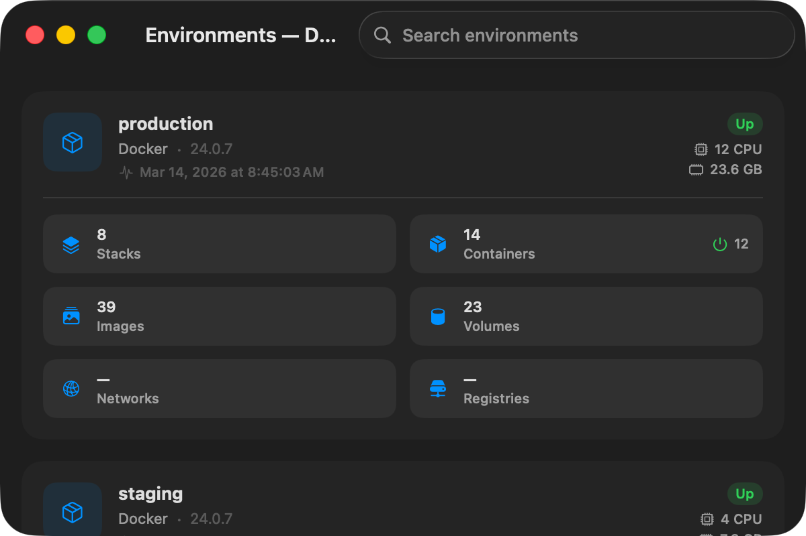 | 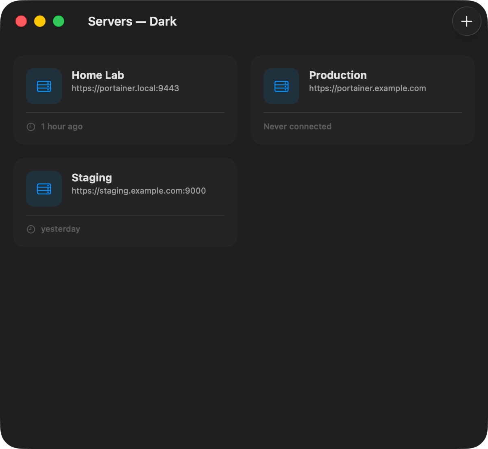 | 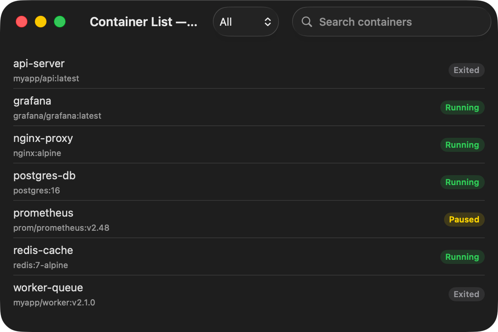 |
| Environments | Servers | Containers |
| 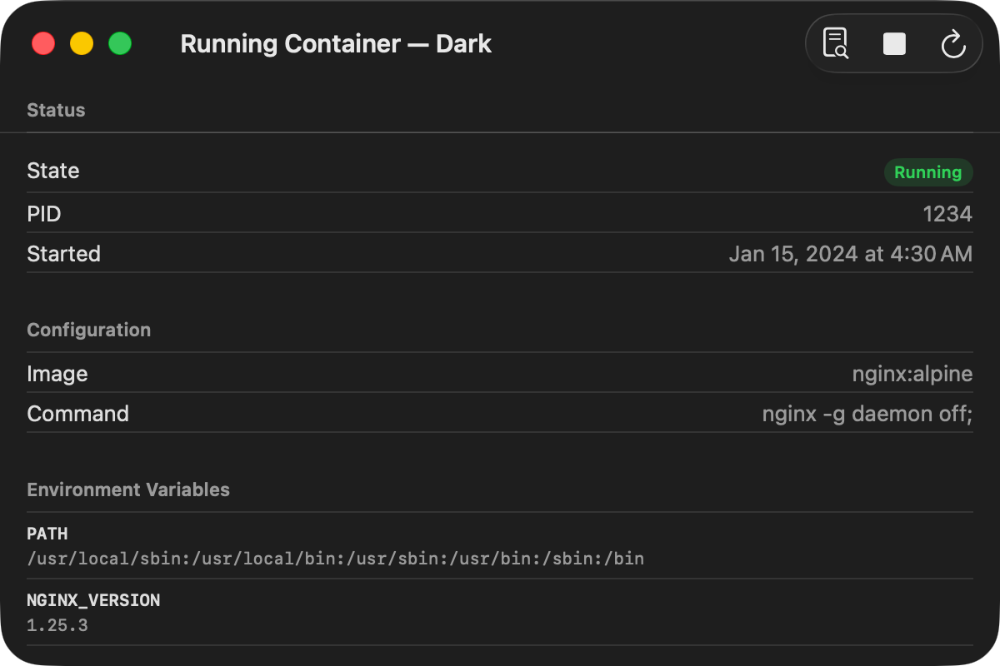 | 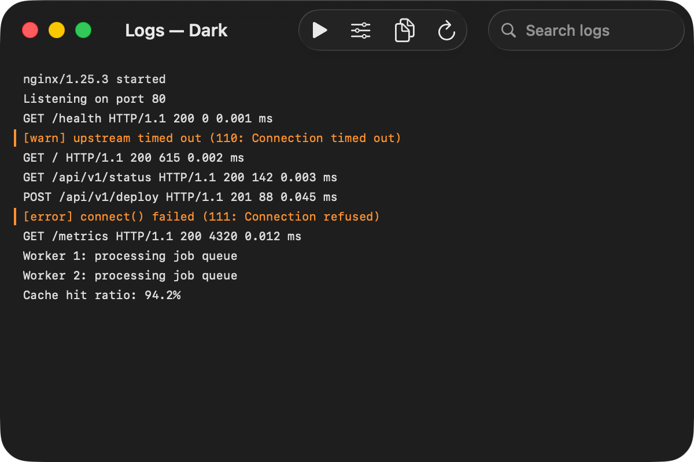 | 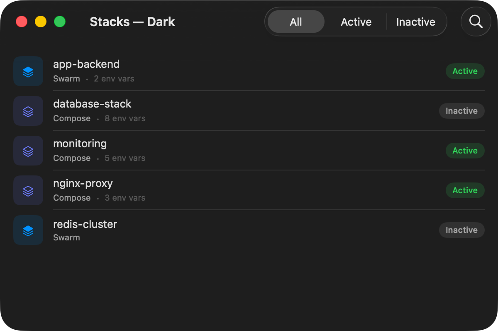 |
| Container Detail | Live Logs | Stacks |
| 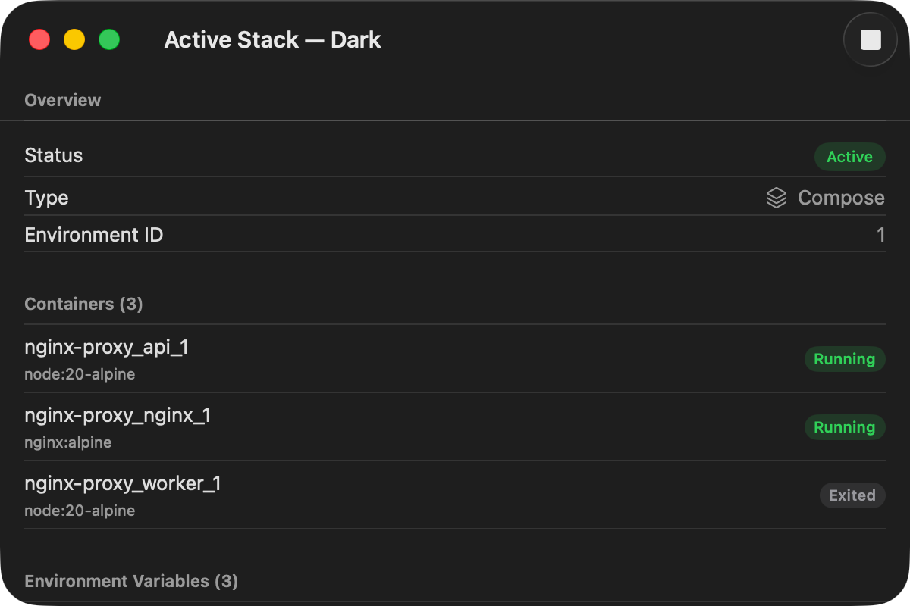 | 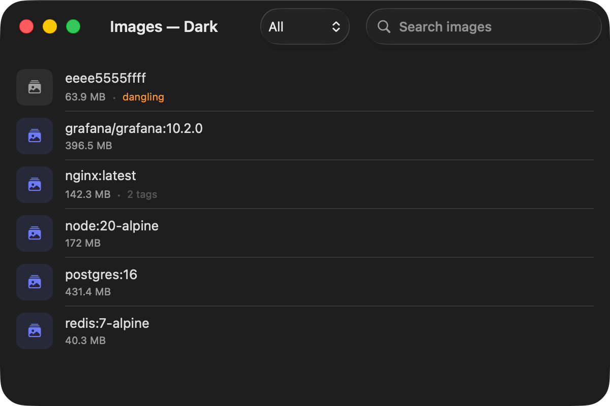 | 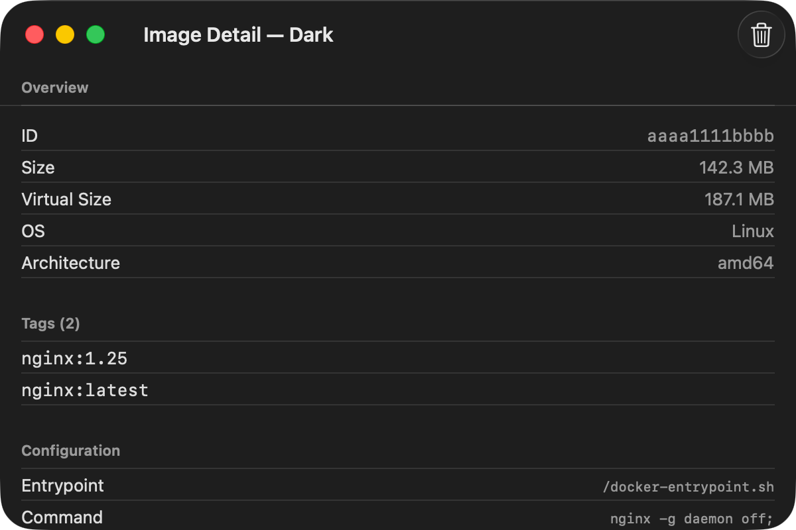 |
| Stack Detail | Images | Image Detail |
| 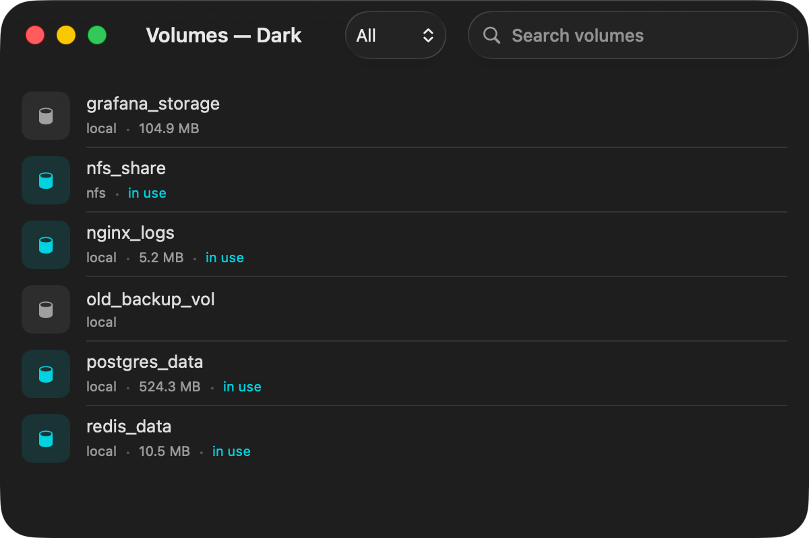 | 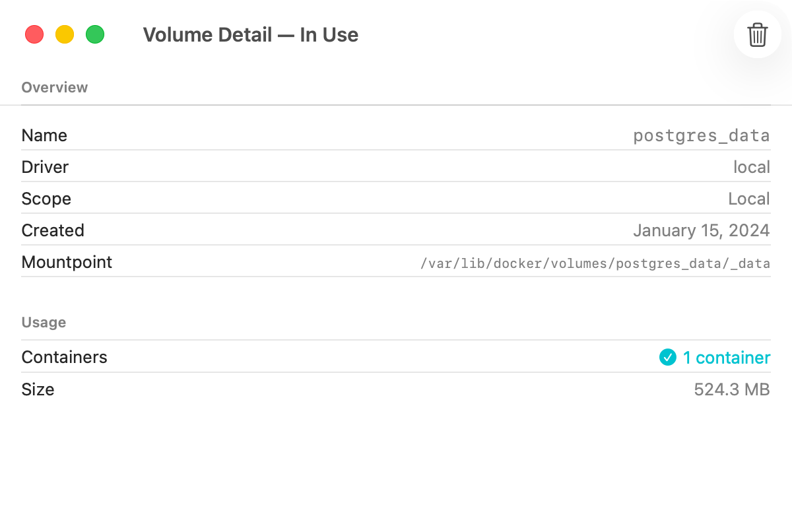 | 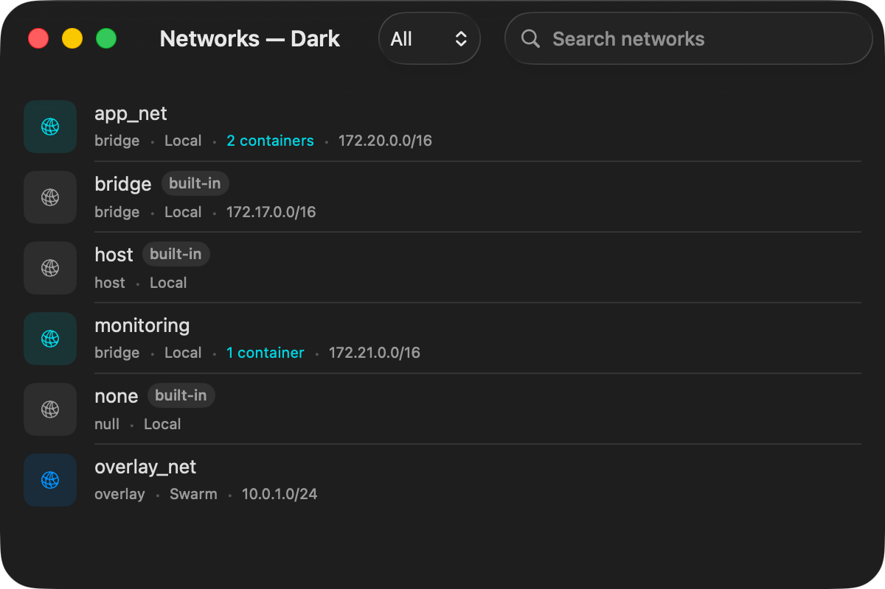 |
| Volumes | Volume Detail | Networks |
| 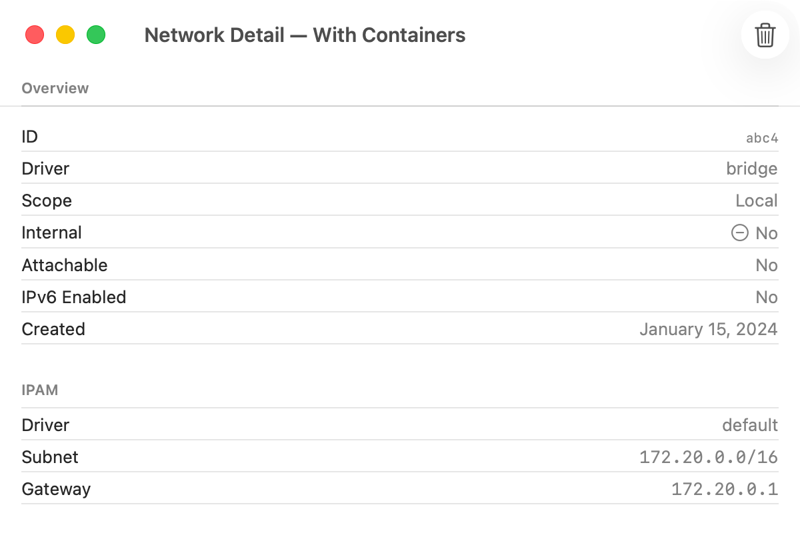 | 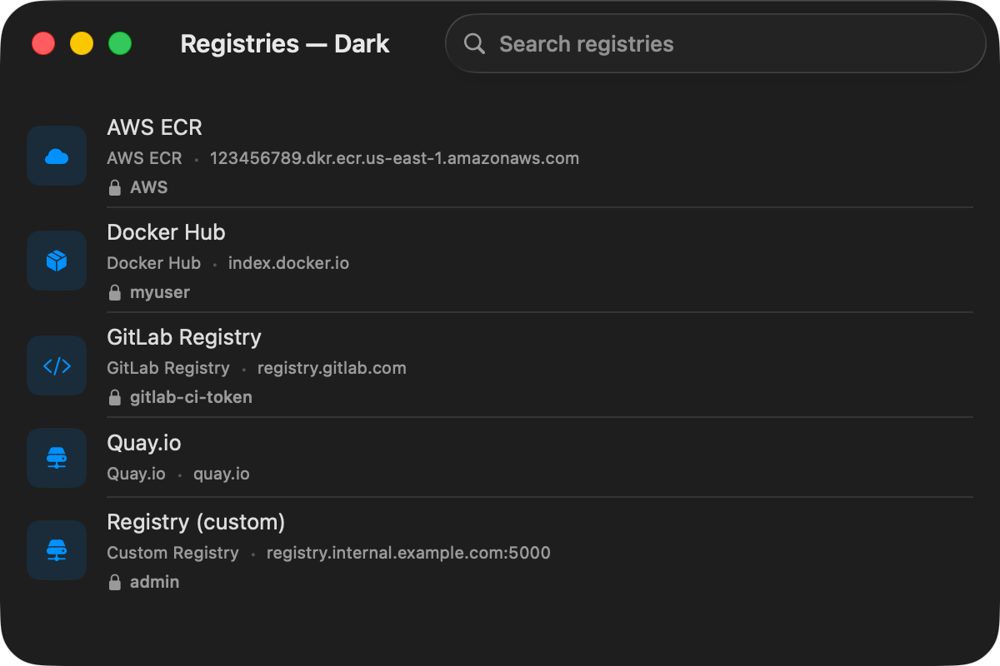 | 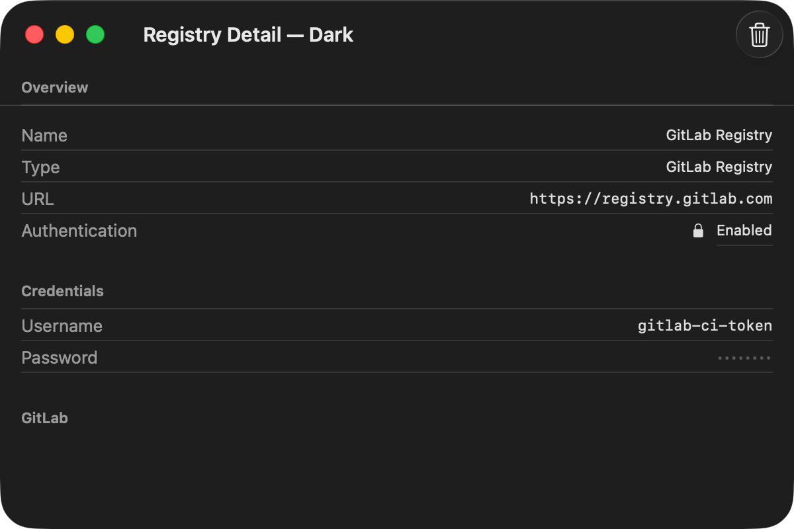 |
| Network Detail | Registries | Registry Detail |

---

## Features

- **Server management** — Add, save, and connect to multiple Portainer CE instances with secure Keychain credential storage and self-signed cert support
- **Environment selection** — Browse all Docker environments on a server with health status and container snapshot summaries
- **Container management** — Full container list with state filtering, start/stop/restart/kill/remove actions, and real-time status updates
- **Container detail** — Complete inspection view: state, configuration, environment variables, ports, mounts, networks, labels, and resource limits
- **Live log streaming** — Real-time log tail with Docker multiplexed stream parsing, stdout/stderr filtering, timestamps, and local search
- **Stack management** — Browse Compose stacks, view compose file YAML, start/stop stacks, and see associated containers
- **Image management** — List images with size and creation date, delete images, prune dangling/unused images
- **Volume management** — List volumes with driver and usage info, create new volumes, delete with in-use warnings
- **Network management** — Browse Docker networks with subnet/gateway detail, view connected containers, delete networks
- **Registry management** — Browse configured Portainer registries with type, URL, and authentication details

---

## Design Principles

1. **One view at a time** — each phase is a complete, testable feature. No half-built screens.
2. **No third-party dependencies** — use Apple frameworks exclusively (URLSession, Security, SwiftData, SwiftUI).
3. **Models match the API** — Codable structs mirror Portainer/Docker API responses exactly. Use `CodingKeys` only when Swift naming conventions differ.
4. **ViewModels isolate logic** — views are thin. All API calls, state management, and data transformation live in `@Observable` view models.
5. **Credentials never touch disk unencrypted** — Keychain only. SwiftData stores server metadata (host, port, display name) but never passwords or tokens.
6. **Progressive disclosure** — list views show essential info; detail views show everything. Don't overwhelm users on summary screens.
7. **Platform-adaptive, not platform-specific** — one codebase with `#if os()` only where truly needed (toolbars, navigation patterns). Lean on SwiftUI's built-in adaptivity.

---

## Getting Started

Open `Portasaurus/Portasaurus.xcodeproj` in Xcode. Connect to a Portainer CE instance and start managing your Docker environments.

---

## Target

- **Portainer CE (Community Edition)** — all API interactions target the CE variant
- **API base path**: `/api/` (no version prefix)
- **Default ports**: `9443` (HTTPS, self-signed cert) or `9000` (HTTP)

---

## Everything below here is in fact AI generated.

If you continue below here, trust, but verify. Thar be dragons. I've asked AI to create a comprehensive plan for me. I plan to build this out one piece at a time and slowly, manually, review and work through the plan. But just know everything below here is AI generated, I haven't reviewed it all. It could all be lies.

---

## What's Next

- [ ] Container stats & resource monitoring (CPU %, memory, network I/O)
- [ ] Interactive shell / exec into running containers
- [ ] Environment dashboard with aggregate counts and quick actions
- [ ] Settings view (auto-refresh interval, log tail count, cert trust management)
- [ ] Improved error handling with retry logic and re-auth prompts
- [ ] macOS refinements (menu bar commands, keyboard shortcuts)
- [ ] visionOS refinements (spatial layout, ornament controls)
- [ ] Accessibility (VoiceOver labels, Dynamic Type, contrast)
- [ ] Container creation wizard
- [ ] Stack creation / YAML editor
- [ ] Multi-server aggregate overview

---

## Architecture Overview

### Tech Stack

| Layer | Technology |
|---|---|
| UI | SwiftUI (iOS 26+, macOS 26+, visionOS 26+) |
| Navigation | `NavigationSplitView` (sidebar → list → detail) |
| Persistence | SwiftData (server metadata, preferences) |
| Secrets | Keychain Services via Security framework (credentials) |
| Networking | `URLSession` with async/await |
| Real-time | `URLSessionWebSocketTask` (exec, attach); chunked HTTP streaming (logs) |
| Concurrency | Swift structured concurrency (async/await, AsyncSequence, actors) |

## Build Plan — Ordered Checklist

Each phase is designed to be self-contained. Complete one before starting the next. Every phase produces a working, testable feature.

### Phase 10: Container Stats & Resource Monitoring

- [ ] **10.1** Implement container stats endpoint — `GET .../containers/{id}/stats?stream=false`
- [ ] **10.2** Parse Docker stats response (CPU %, memory usage/limit, network I/O, block I/O)
- [ ] **10.3** Add stats section to `ContainerDetailView`
  - Live-updating gauges: CPU %, memory usage bar, network Rx/Tx
  - Polling-based refresh (every 2-3 seconds)
- [ ] **10.4** Add stats summary to `ContainerListView`
  - Optional column/row showing CPU% and memory for running containers

### Phase 11: Container Exec (Interactive Shell)

- [ ] **11.1** Implement exec creation — `POST .../containers/{id}/exec`
- [ ] **11.2** Implement WebSocket connection to `/api/websocket/exec`
- [ ] **11.3** Build `ContainerExecView`
  - Terminal-style view with text input
  - Command history (up/down arrow on macOS)
  - Shell selection (sh, bash, zsh, ash)
  - Proper WebSocket lifecycle management (connect, reconnect, close)

### Phase 12: Dashboard / Overview

A summary view after selecting an environment.

- [ ] **12.1** Build `DashboardView`
  - Container summary: running / stopped / total counts with visual breakdown
  - Stack summary: active / inactive counts
  - Resource usage: total images, volumes, networks
  - Recent events or activity (if feasible via Docker events API)
  - Quick-action shortcuts to common tasks
- [ ] **12.2** Wire dashboard as the default view after environment selection (before container list)

### Phase 13: Settings & Polish

- [ ] **13.1** Build `SettingsView`
  - Auto-refresh interval configuration
  - Default log tail count
  - Theme (respect system appearance)
  - Self-signed certificate trust management per server
  - Clear all saved servers & credentials
- [ ] **13.2** Add proper error handling throughout
  - Network error banners (connection lost, timeout, server unreachable)
  - Retry logic with exponential backoff for transient failures
  - Graceful handling of 401 (re-auth prompt) and 403 (permission denied)
- [ ] **13.3** macOS-specific refinements
  - Menu bar commands for common actions
  - Keyboard shortcuts
  - Window management (sidebar toggle)
- [ ] **13.4** visionOS-specific refinements
  - Appropriate use of depth and spatial layout
  - Ornament-based controls where applicable
  - Comfortable text sizing for spatial computing
- [ ] **13.5** Accessibility
  - VoiceOver labels for all interactive elements
  - Dynamic Type support
  - Sufficient color contrast (don't rely solely on color for status)

### Phase 14: Advanced Features (Future)

These are stretch goals for after the core app is solid.

- [ ] **14.1** Container creation wizard (image selection, port mapping, volume mounts, env vars)
- [ ] **14.2** Stack creation (paste/edit compose YAML, deploy)
- [ ] **14.3** Docker registry browsing (configured registries in Portainer)
- [ ] **14.4** Multi-server overview (aggregate view across all saved servers)
- [ ] **14.5** Push notifications via background refresh (container state changes)
- [ ] **14.6** Widgets (iOS/macOS) showing container status summary
- [ ] **14.7** Shortcuts/Siri integration ("How many containers are running?")
- [ ] **14.8** Import/export server configurations (for sharing between devices)
